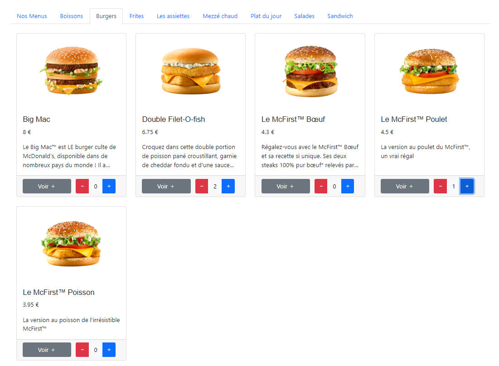

# PJI - Application web pour la gestion d'un restaurant

## Problematique

Un restarant de plats mix (traditionnels et fast-food) veut attirir plus de clients en leurs donnant la possibilité de commander en ligne et de venir chercher leurs commandes, ainsi que la possibilité de profiter de leurs repas sur place.
Pour faciliter la gestion, le gerant a pour idée de creer une application web qui va l'aider à automatiser les taches de gestion du restaurant.

## Technologies utilisees


Pour ce projet, nous avons utilisé les technologies suivantes :

**Pour le backend :**
Ona utilisé le framwork Spring Boot pour la communication avec la base de données MongoDB et le stockage des données.

Le code de la partie backend est disponible sur le [Github](https://github.com/hatimmrabet/RestaurantAPI)

**Pour le frontend :**
On a utilisé le framework Angular 13 pour le frontend. Le code est disponible sur le [Github](https://github.com/hatimmrabet/MyRestaurant)


## Realisation

### Base de données : MongoDB

Pour la realisation de ce projet on a utiliser une base de données noSQL MongoDB.

**Structure de la base de données**

La base de données contient les collections suivantes :

- **`users`** : contient tous les informations de chaque utilisateur avec son type de compte (Admin, worker ou client)
- **`produits`** : contient tous les produits du restaurant avec leur description, prix, image, categorie et la liste des ingredients.
- **`menus`** : contient tous les menus du restaurant avec leur description, prix, image, et la liste des produits de chaque menu.
- **`commandes`** : contient toutes les commandes du restaurant avec leur description, prix total, et la liste des produits de chaque commande avec sa quantité, et finalement la reference vers l'utilisateur qui a passé la commande.
- **`categories`** : contient toutes les categories de produits du restaurant.
- **`ingredients`** : contient tous les ingredients qu'on peut utiliser dans un produit.

***exemple :***

```json
"users": {
    "id":"objectId",
    "name": "string",
    "firstName":"string",
    "lastName":"string",
    "email":"string",
    "password":"string",
    "phoneNumber":"string",
    "role":"string",
    "address":"string",
    "birthDate":"Date",
    "createdAt":"Date",
    "updatedAt":"Date",
}

"produits": {
    "id":"objectId",
    "categorie":"DBref{categories}",
    "ingredients":"array[DBref{ingredients}]",
    "name": "string",
    "description":"string",
    "price":"number",
    "image":"string",
    "createdAt":"Date",
}

"menus"{
    "id":"objectId",
    "produits":"DBref{produits}",
    "name": "string",
    "description":"string",
    "price":"number",
    "image":"string",
    "createdAt":"Date",
}

"ingredients"{
    "id":"objectId",
    "name": "string",
}

"catetgories"{
    "id":"objectId",
    "name": "string",
}

"commandes"{
    "id":"objectId",
    "numero":"string",
    "etat":"string",
    "type":"string",
    "client":"DBref{users}",
    "price":"number",
    "items":"array[{
        'produit':'DBref{produits}',
        'quantite':'number',
    }]",
    "produits":"DBref{produits}",
    "date":"Date",
}
```

### Back-end : Spring Boot

Pour le back-end on a utiliser le framework Spring Boot.

**Structure du back-end**

L'architecture du notre back-end est constitué par des package qui regroupe chaque les classes selon leur type (controller, service, repository, etc...)
- Controllers
  - AuthController
  - CategoriesController
  - CommandesController
  - IngredientsController
  - MenusController
  - ProduitsController
  - UsersController
- Exceptions
  - IngredientNotFoundAdvice
  - IngredientNotFoundException
  - UserNotFoundAdvice
  - UserNotFoundException
- Models
  - request
    - CommandeRequest
    - LoginRequest
    - UserPutRequest
  - response
    - CommandeDTO
    - JwtResponse
    - ResponseMessage
  - Article
  - ArticleCommande
  - categories
  - Commande
  - CommandeItem
  - EOrderStatus
  - ERole
  - Ingredient
  - Menu
  - MenuCommande
  - Produit
  - ProduitCommande
  - User
  - UserDTO
- repository
  - categoriesRepository
  - ingredientsRepository
  - usersRepository
  - commandesRepository
  - menusRepository
  - produitsRepository
- security
  - jwt
    - AuthEntryPointJwt
    - AuthTokenFilter
    - JwtUtils
  - services
    - UserDetailsServiceImpl
    - UsersDetailsImpl
  - WebSecurityConfig
- WebConfigurations

**Base de données**

Pour la liaison avec la base de données on a modifier le fichier `application.proprities` où on a specifié le nom de la base, le host et le port.

```java
spring.data.mongodb.database=laPetiteSyrienne_db
spring.data.mongodb.host=localhost
spring.data.mongodb.port=27017
```

**Securité**

Pour securisé les endpoints, ona utilisé JWT pour la gestion des tokens. Seul les utilisateurs qui ont un token valide peuvent acceder aux endpoints privés et securisés.

**Controllers**

Parmi les fonctionnalité avancées de notre back-end, on a utilisé les controllers pour la gestion des utilisateurs, les commandes, les menus, les produits et les categories.

Pour la gestion des produits et des menus on a des contolleurs qui servent a creer un nouveau menu ou produit et ajouté l'image associé à cet article au dossier `ressources/static/images`, ainssi que de creer une nouvelle categorie ou ingredient s'il n'existait pas avant dans notre base de données.

Lors de la suppression d'une categorie, ingredient ou produit, on a supprimé l'image associé à cet article au dossier `ressources/static/images`. 
Et ceci est fait seulement si :
- le produit n'est utilisé dans aucun menu.
- l'ingredient n'est utilisé dans aucun produit.
- la categorie n'est liée à aucun produit.

Sinon, l'utilisateur sera informé qu'il ne peut pas supprimer cette categorie, ingredient ou produit, avec un mesage plus detaillé pour savoir pourquoi et où on a utilisé ce produit, ingredient, categorie.

Lors de la suppression d'un utilisateur, si l'utilisateur n'a aucune commande on le supprime directement de la se de données, sinon on supprime tous ses données (nom, prenom, email, etc...) mais on le garde dans la base de données pour avoir une homogeneite dans notre base de données, et pouvoir savoir combient d'utilisateurs ont passé des commandes.

**Classes DTO**

Pour eviter d'envoyer des données sensibles comme les mots de passes... on a créé des classes DTO qui sont des classes qui sont utilisées pour envoyer que les données necessaires aux front-ends.

### Front-end

Pour le front-end on a utiliser le framework Angular 13.

**Structure du front-end**

Notre projet est constitué de 4 types de composants :

- **`Components`** : les composants sont des composants qui sont utilisé pour la gestion des utilisateurs, les commandes, les menus, les produits et les categories, et tout ce qui est lié à l'affichage des données.
- **`Services`** : les services sont les fonctions et les fonctionnalitées utilisées par les composants, et qui permet de passer des requetes à l'api.
- **`Models`** : les models sont les classes qui representent les données de notre base de données (User, Article, Commandes, etc..).
- **`Validators`** : contient des validateurs pour les formulaires et surtout pour la verification de l'age de l'utilisateur avant de creer son compte (age minimum 13 ans).

**Scenarios de l'application :**

***Scenario 1 : Creer un compte***

Pour creer un compte l'utilisateur doit remplir un formulaire et respecter les conditions suivantes : 
  - avoir plus de 13 ans (l'utilisateur ne peut pas valider le formulaire si il a mois de 13 ans).
  


  - utiliser un email valide (l'utilisateur ne peut pas valider le formulaire si il n'a pas un email valide et la creation du compte sera annulé si l'adresse mail est deja utilisé).


***Scenario 2 : Connexion***

Si l'utilisateur a un compte, il peut se connecter avec son email et son mot de passe. si l'authentification est reussie, on a un token qui est envoyé dans le header de la reponse.

Il y a 3 types de compte ce qui change l'affichage de la partie privée :

  - **`Client`** : compte d'un client.
  
  - **`Worker`** : compte d'un employé, il a des options pour la geston des commandes des clients.
  
  - **`Admin`** : compte d'un admin et a plus d'option pour la gestion.
  


***Scenario 3 : Passer une commande*** 

Pour passer une commnde, l'utilisateur doit d'abord choisir des menus ou/et des produits et les ajoutés à son panier.
  


Pour choisir un menu, il doit cliquer sur ***`voir plus de details`*** d'un menu, il sera rediriger vers une page avec le details du menu, où il aura la possibilité de choisir un article par categorie, et l'ajouter au panier par la suite.
L'utilisateur ne peut pas choisi plus d'un article par categorie dans un menu et dans ce cas le boutton d'ajout sera desactiver.


Pour ajouter un produit, en peut directement cliquer sur le `+` pour l'ajouter au panier, ou par la page de details, et le `-` pour l'enlever du panier.



Une fois l'utilisateur a choisi tous les articles qu'il veut, il peut voir le montant total et le details de la commande dans la page `My Cart`.


L'utilisateur ne peut valider la commande que s'il est connecté, et a choisi si elle sera sur place ou à emporter.

il peut aussi à partir de cette page, vider le panier, enlever ou ajouter un article au panier.

Quand l'utilisateur valide la commande il aura un message de confirmation, avec le numero de commande. il pourra par la suite suivre l'etat de la commande dans la page `My Orders`.


***Scenario 4 : Gerer une commande***

Depuis la page `My orders` l'utilisateur peut consulter les details d'une commande, et aussi la modifier ou l'annuler si elle est encore en attente.
Une fois la commande est en preparation il ne peut plus la modifier ni l'annuler.

Quand l'utilisateur essaie de modifier sa commande, la commande de base est annulé et les articles sont ajoutés au panier de l'utilisateur.

Les `Admins` et les `workers` peuvent changer l'etat de la commande en attente en `preparation`, `en cours`, `livree`, `annulee` depuis la page `All Orders`.

Une commande annulé ne peut plus être modifié, ni changer son etat.


***Scenario 5 : Gerer les Produits***

Les admins et les employés peuvent gerer les produits, ils peuvent ajouter, modifier, supprimer des produits.

  - **`Ajouter`** : pour ajouter un produit, il faut remplir un formulaire avec les informations du produit, et l'image du produit. 
  Il faut aussi choisir la categorie du produit depuis les categories qui existent deja, sinon inserer le nom de la nouvelle categorie et elle sera creer directement apres la validation du formulaire, pareil pour les ingredients.
  

  - **`Modifier`** : pour modifier un produit, il faut modifier le formulaire avec les nouvelles informations du produit, et on peut soit garder l'ancienne image ou inserer une nouvelle.
  

  - **`Supprimer`** : pour supprimer un produit, il faut cliquer sur le boutton `supprimer` dans la page `All Products`, seul les produits qui ne sont pas dans un menu peuvent etre supprimer. Si c'est le cas, un message d'erreur sera afficher avec la liste des menus qui contiennent le produit.
  

***Scenario 5 : Gerer les Menus***

Les admins et lles employés peuvent gerer les menus, ils peuvent ajouter, modifier, supprimer des menus.

  - **`Ajouter`** : pour ajouter un menu, il faut remplir un formulaire avec les informations du menu, et l'image du menu, et selectionner les produits qu'on aura dans ce menu.
  Par la suite, l'utilisateur ne pourra selectionner qu'un seul produit par categorie pour passer sa commande.
  

  - **`Modifier`** : pour modifier un menu, il faut modifier le formulaire avec les nouvelles informations du menu, et on peut soit garder l'ancienne image ou inserer une nouvelle.
  

  - **`Supprimer`** : pour supprimer un menu, il faut cliquer sur le boutton `supprimer` dans la page `All Menus`.
  


***Scenraio 6 : Gerer les Categories et les ingredients***

Les admins peuvent gerer les categories et les ingredients, ils peuvent ajouter, modifier, supprimer des categories et des ingredients.

  - **`Ajouter`** : pour ajouter une categorie ou un ingredients, il faut juste ajouter son nom dans le model.
  

  - **`Modifier`** : pour modifier une categorie ou un ingredients, il faut modifier son nom dans le model, apres avoir cliquer sur le boutton edit a coter du nom du categorie.
  

  - **`Supprimer`** : pour supprimer une categorie ou un ingredients, il faut cliquer sur le boutton `supprimer` dans la page `All Categories` ou `All Ingredients`, seul les categories qui n'ont aucun produit associé peuvent etre supprimé, sinon, on aura un message d'erreur avec le nom des produits associé à cette categorie, ou le nom des produits qui utilise cet ingredient.
  

***Scenario 7 : Gerer les utilisateurs***

Les admins peuvent gerer les utilisateurs, ils peuvent ajouter, modifier, supprimer des utilisateurs.

  - **`Ajouter`** : pour ajouter un utilisateur, il faut remplir un formulaire avec les informations du utilisateur, et choisir le type du compte.
  

  - **`Modifier`** : pour modifier un utilisateur, il faut modifier le formulaire avec les nouvelles informations du utilisateur, et on peut soit garder l'ancien mot de passe ou creer un autre.
  

  - **`Supprimer`** : pour supprimer un utilisateur, il faut cliquer sur le boutton `supprimer` dans la page `All Users`.
  
  les informations du compte supprimé sont tous supprimé mais pour garder l'homogénéité des données, on garde l'id de l'utilisateur dans la base de données, et on modifie son nom.
  
